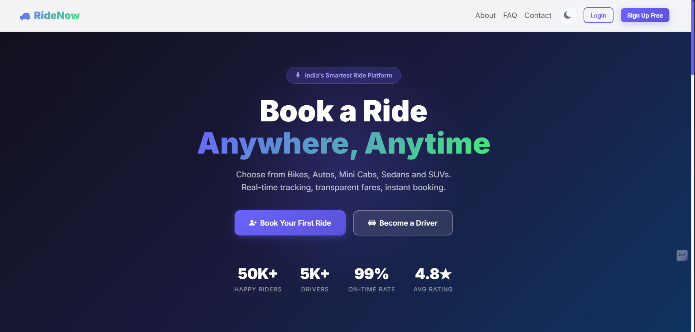
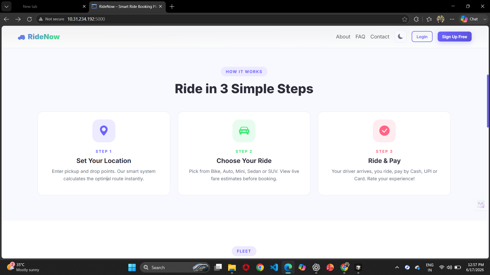
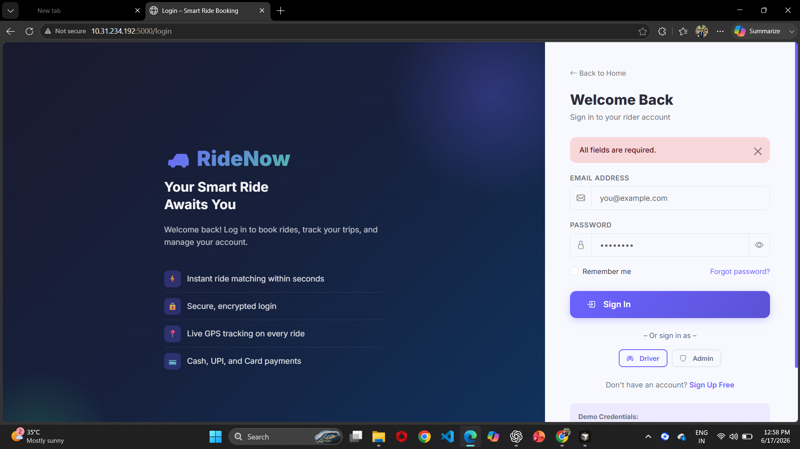
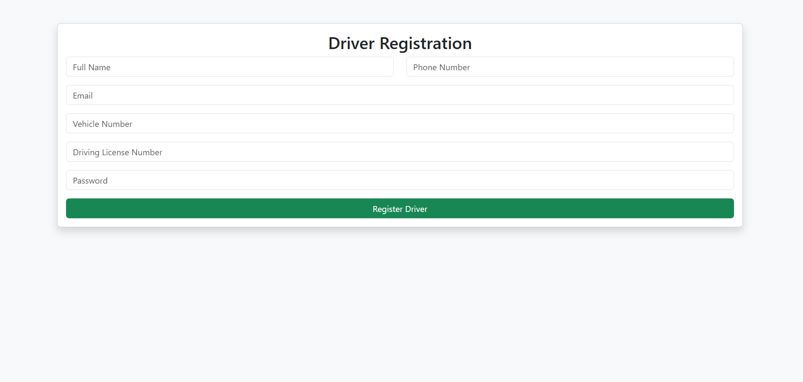

# 🚖 RideBook - Ride Booking System

A full-stack Ride Booking Web Application inspired by Ola and Uber, developed using **Python (Flask), HTML, CSS, JavaScript, Bootstrap, and MySQL**.

The platform allows users to book rides, drivers to manage trips, and administrators to monitor the entire system through dedicated dashboards.

---

## 📌 Features

### 👤 User Module

* User Registration & Login
* Book a Ride
* View Ride Status
* Ride History
* Payment Management
* Driver Reviews & Ratings
* Profile Management

### 🚗 Driver Module

* Driver Registration & Login
* Accept / Reject Ride Requests
* Active Ride Management
* Ride History
* Earnings Dashboard
* Profile Management

### 🛠️ Admin Module

* Admin Login
* User Management
* Driver Verification
* Booking Management
* Revenue Tracking
* Promo Code Management

### 🌐 Public Pages

* Landing Page
* About Us
* Contact Us
* FAQ Section

---

## 🛠️ Tech Stack

### Frontend

* HTML5
* CSS3
* Bootstrap 5
* JavaScript

### Backend

* Python
* Flask

### Database

* MySQL

### Tools

* Git
* GitHub
* VS Code

---

## 📂 Project Structure

```text
ride-booking/
│
├── app.py
├── requirements.txt
│
├── static/
│   ├── css/
│   ├── js/
│   └── images/
│
├── templates/
│   ├── auth/
│   ├── user/
│   ├── driver/
│   ├── admin/
│   └── pages/
│
├── routes/
├── models/
├── database/
└── README.md
```

---

## 🚀 Installation

### Clone Repository

```bash
git clone https://github.com/yourusername/ride-booking.git
cd ride-booking
```

### Create Virtual Environment

```bash
python -m venv venv
```

### Activate Environment

Windows:

```bash
venv\Scripts\activate
```

Linux/Mac:

```bash
source venv/bin/activate
```

### Install Dependencies

```bash
pip install -r requirements.txt
```

### Run Project

```bash
python app.py
```

Open:

```text
http://127.0.0.1:5000
```

---

## 📸 Screenshots

screenshots :



---



---



---


  

---

## 🎯 Future Enhancements

* Google Maps Integration
* Real-Time Driver Tracking
* OTP Verification
* Online Payment Gateway
* Push Notifications
* AI-Based Fare Prediction
* Mobile Application Version

---

## 📚 Learning Outcomes

This project helped me gain practical experience in:

* Full Stack Web Development
* Flask Framework
* Database Design
* Authentication Systems
* Dashboard Development
* CRUD Operations
* Git & GitHub Workflow

---

## 👨‍💻 Author

**Kashyap Patel**

* GitHub: https://github.com/yourusername
* LinkedIn: https://linkedin.com/in/yourprofile

---

## ⭐ Support

If you found this project useful, please consider giving it a ⭐ on GitHub.
